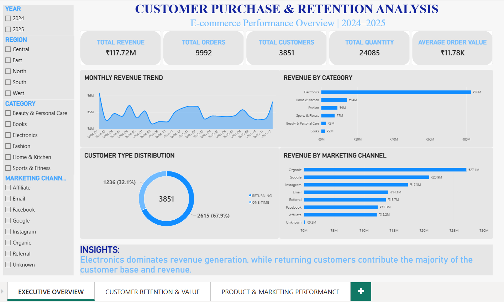
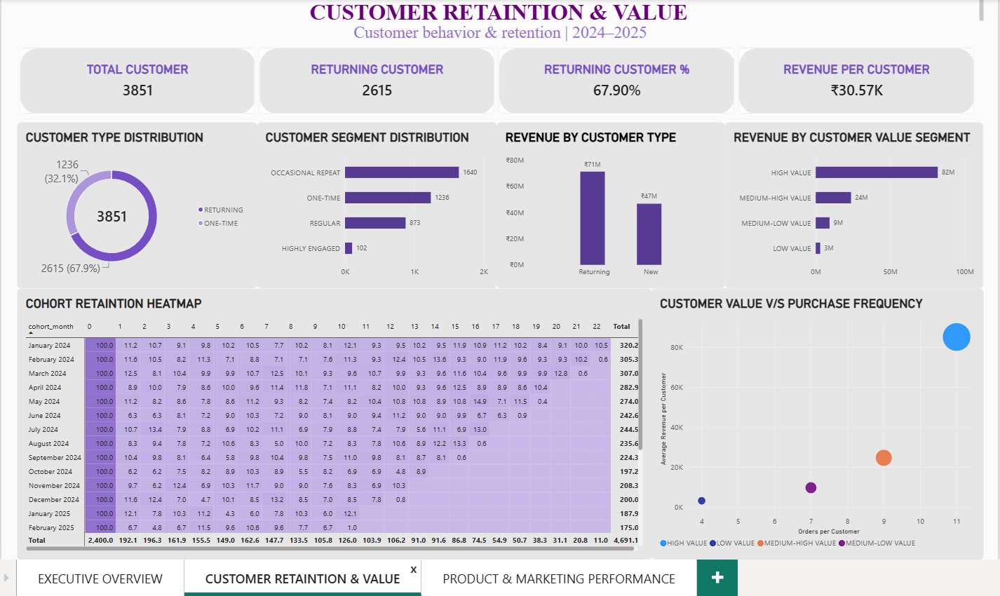
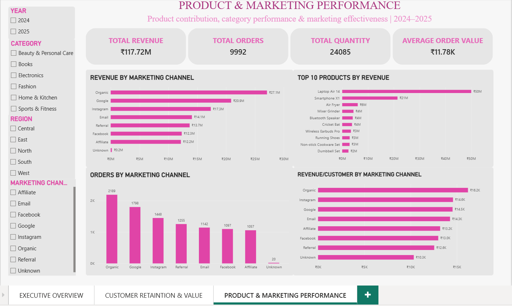

# Customer Purchase & Retention Analysis

## Project Overview

This project analyzes customer purchasing behavior for an e-commerce business
to understand customer retention, purchasing patterns, product performance.

The project follows a complete data analytics workflow:

Raw Data → Data Audit → Data Cleaning → SQL Analysis → Power BI Dashboard → Business Insights

## Business Problem

The e-commerce company wants to understand:

- Who are its customers?
- How many customers return to make additional purchases?
- Which products and categories generate the most revenue?
- Which customer segments are most valuable?
- Which marketing channels attract customers?

## Dataset

The dataset contains e-commerce transaction-level data covering 2024–2025.

Key dimensions include:

- Customer
- Order
- Product
- Payment Method
- Marketing Channel
- Customer Type

## Tools Used

- Microsoft Excel
- SQL
- Power BI
- GitHub

## Project Status

### Phase 1 — Data Audit ✅

Completed:

- Dataset structure validation
- Unique order/customer/product analysis
- Missing-value analysis
- Duplicate detection
- Invalid-value detection
- Categorical consistency checks

### Phase 2 — Data Cleaning ✅

The dataset was cleaned using Microsoft Excel.

Cleaning steps included:

- Removed 25 exact duplicate records
- Removed 8 records with invalid negative quantities
- Removed 6 records with discounts above 100%
- Standardized `Orissa` to `Odisha`
- Resolved missing City values using available customer information
- Replaced missing Discount values with 0%
- Replaced missing Payment Method values with `Unknown`
- Replaced missing Marketing Channel values with `Unknown`
- Validated revenue using an independent business-rule calculation

### Final Dataset

- Initial records: 16,878
- Records removed: 39
- Final records: 16,839
- Duplicate records remaining: 0
- Business-rule validation errors: 0

### Phase 3 — SQL Analysis ✅

Completed:

- Revenue performance analysis
- Monthly revenue and MoM growth analysis
- Revenue by product category
- Top-performing products
- Customer purchase frequency analysis
- Returning vs one-time customer analysis
- Customer value segmentation
- Revenue quartile analysis
- Marketing channel performance
- Cohort retention analysis
- Customer retention analysis

### Phase 4 — Power BI Dashboard ✅

Created a 3-page interactive Power BI dashboard:

**Page 1 — Executive Overview**
- Revenue KPIs
- Monthly revenue trend
- Revenue by category
- Marketing channel performance
- Executive-level business summary

**Page 2 — Customer Retention & Value**
- Returning vs one-time customers
- Customer segmentation
- Customer value segmentation
- Revenue contribution by customer segment
- Customer value vs purchase frequency
- Cohort retention heatmap

**Page 3 — Product & Marketing Performance**
- Revenue by category
- Top 10 products by revenue
- Revenue by marketing channel
- Revenue per customer by marketing channel
- Order volume by marketing channel

### Executive Overview



### Customer Retention & Value



### Product & Marketing Performance



### Phase 5 — Business Insights ✅

Key findings and recommendations were developed from the SQL analysis and Power BI dashboard.

Major areas analyzed:

- Revenue performance
- Customer retention
- Customer value
- Product concentration
- Category performance
- Marketing channel performance
- Cohort retention
- Business risks and opportunities

## Key Findings

- Total revenue: **₹117.72M**
- Total orders: **9,992**
- Total customers: **3,851**
- Returning customers: **67.9%**
- Returning customers generate **87.27% of total revenue**
- High-value customers represent approximately **25% of customers but generate 69.5% of revenue**
- Electronics contributes approximately **70.18% of total revenue**
- Top 10 products contribute approximately **85.97% of total revenue**
- Organic is the highest-revenue marketing channel
- Cohort analysis shows a substantial decline in customer activity after the initial purchase

Detailed findings are available in:

`insights/business_insights.md`
## Data Quality Findings

The initial audit identified:

- 25 exact duplicate rows
- Missing values in City
- Missing values in Discount
- Missing values in Payment Method
- Missing values in Marketing Channel
- Negative quantities
- Discount values above 100%
- State naming inconsistency between Odisha and Orissa

## Repository Structure

```text
Customer-Purchase-Retention-Analysis/
│
├── data/
│   ├── raw/
│   └── cleaned/
│
├── documentation/
│   ├── customer_purchase_retention_data_dictionary_v1.xlsx
│   └── data_quality-report.md
|   
│
├── excel/
│   └── Customer_Retention_Analysis.xlsx
│
├── sql/
│   ├── 01_data_validation.sql/
│   ├── 02_monthly_revenue_analysis.sql/
│   ├── 03_category_analysis.sql/
│   ├── 04_product_analysis.sql/
│   ├── 05_customer_analysis.sql/
│   ├── 06_cohort_retention_analysis.sql/
│   ├── 07_customer_value_analysis.sql/
│   └── 08_marketing_analysis.sql/
│
├── powerbi/
│   └── customer_purchase_retention_analysis-PowerBI.pbix
│
├── screenshots/
│   ├── 01_executive-overview.png
│   ├── 02_customer-retaintion-and-value.png
│   └── 03_product-and-marketing-performance.png
│
├── insights/
│   └── business_insights.md
│
└── README.md
```
## Project Workflow

```text
Raw Dataset
     ↓
Data Audit
     ↓
Data Cleaning & Validation
     ↓
SQL Analysis
     ↓
Customer & Revenue Analysis
     ↓
Power BI Dashboard
     ↓
Business Insights
     ↓
Business Recommendations
```
## Skills Demonstrated

### Data Cleaning
- Data quality auditing
- Duplicate detection and removal
- Missing-value handling
- Invalid-value detection
- Data standardization
- Business-rule validation

### SQL
- Aggregations and grouping
- JOIN operations
- Common Table Expressions (CTEs)
- Window functions
- Customer segmentation
- Revenue analysis
- Month-over-month analysis
- Cohort analysis
- Customer retention analysis
- Revenue quartile analysis

### Power BI
- Data modeling
- DAX measures
- KPI development
- Interactive dashboards
- Customer segmentation
- Cohort retention visualization
- Conditional formatting
- Slicers and cross-filtering
- Business storytelling

### Business Analytics
- Customer retention analysis
- Customer value analysis
- Product performance analysis
- Marketing channel analysis
- Revenue concentration analysis
- Risk identification
- Data-driven recommendations

## Business Insights & Recommendations

### Customer Retention
Returning customers represent 67.9% of customers but generate 87.27% of total revenue, making customer retention a major revenue driver.

**Recommendation:** Focus on repeat-purchase campaigns, loyalty programs, personalized recommendations, and early post-purchase engagement.

### Customer Value
Approximately 25% of customers generate 69.5% of total revenue.

**Recommendation:** Prioritize high-value customers through VIP experiences, personalized offers, and targeted retention strategies.

### Product & Category Concentration
Electronics contributes approximately 70.18% of total revenue, while the Top 10 products contribute approximately 85.97%.

**Recommendation:** Protect high-performing products while developing secondary categories to reduce revenue concentration risk.

### Marketing Performance
Organic is the strongest revenue-performing marketing channel and generates the highest revenue per customer.

**Recommendation:** Continue investing in high-performing acquisition channels while evaluating marketing performance using customer value and acquisition costs.

### Cohort Retention
Cohort analysis shows a substantial decline in customer activity after the initial purchase.

**Recommendation:** Strengthen second-purchase and early lifecycle campaigns to improve customer retention and purchase frequency.

For detailed analysis, see `insights/business_insights.md`.
